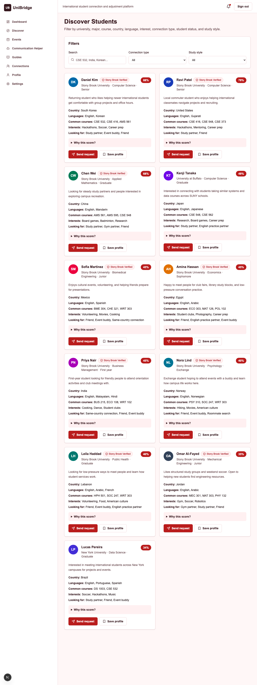
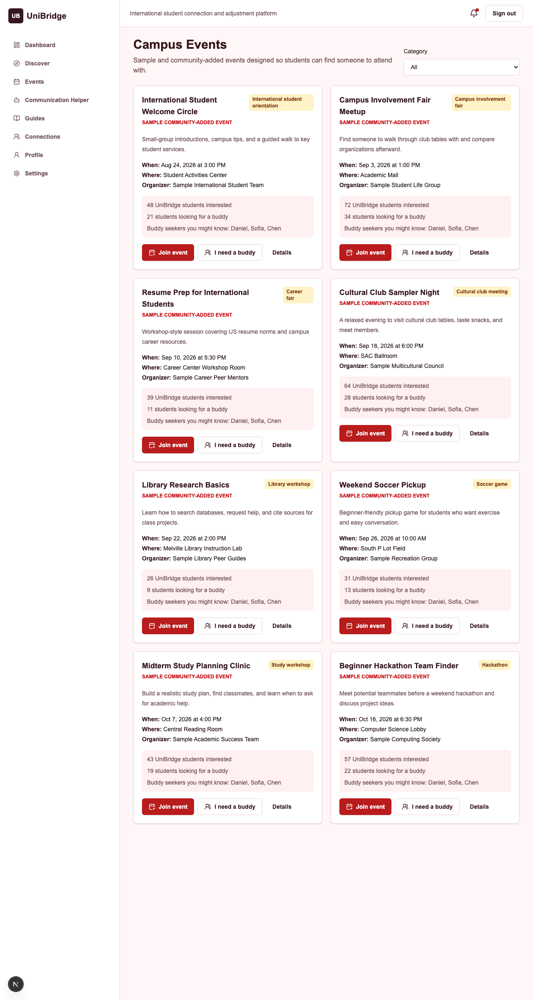

# UniBridge

**Connect. Belong. Succeed.**

UniBridge is a full-stack student connection platform built to help international university students feel supported from the moment they arrive on campus. Students can create a detailed profile, highlight their courses and interests, discover compatible classmates, send connection requests, save profiles they want to revisit, and build smaller communities around shared goals.

The platform also supports practical campus-life workflows: students can browse events, join activities, request an event buddy, create or join small buddy groups, and chat with group members before meeting in person. UniBridge includes helpful guides, a dashboard question assistant for general university-life questions, and a communication helper that drafts respectful messages for professors, classmates, advisors, and campus offices.

Live site: [https://uni-bridge-nu.vercel.app](https://uni-bridge-nu.vercel.app)

## Preview


## Screenshots

### Dashboard


### Discover Students



### Events




## Features

- University email account creation and sign-in
- Student profile setup with name, university, major, year, country, languages, courses, interests, bio, and profile photo
- Profile completion tracking
- Student discovery with transparent compatibility scores
- Connection requests with sent, pending, accepted, declined, and removed states
- Saved profiles in the Connections page
- Campus events with join and buddy-request actions
- Event buddy groups with create, join, leave, delete, member lists, preferences, and group conversation
- Dashboard chatbot for general university and campus-life questions
- Communication helper for drafting polished university messages
- Practical guides for common international student situations
- Production-backed Supabase data for users, profiles, requests, events, groups, and messages

## Tech Stack

- Next.js App Router
- TypeScript
- Tailwind CSS
- Supabase Auth and PostgreSQL
- Groq API through server routes
- Zod validation
- Lucide React icons
- Vitest
- Vercel

## Project Structure

```bash
app/                 Next.js routes and pages
components/          Reusable UI and feature components
lib/                 Data access, validation, matching, and Supabase helpers
supabase/            Database reset, schema, seed, and messaging SQL
docs/screenshots/    README screenshots
```

## Environment Variables

Create `.env.local` from `.env.example` and add:

```bash
NEXT_PUBLIC_SUPABASE_URL=
NEXT_PUBLIC_SUPABASE_ANON_KEY=
SUPABASE_SERVICE_ROLE_KEY=
GROQ_API_KEY=
NEXT_PUBLIC_APP_URL=http://localhost:3000
```

For Vercel, add the same variables in **Project Settings → Environment Variables**. Use the live domain for production:

```bash
NEXT_PUBLIC_APP_URL=https://uni-bridge-nu.vercel.app
```

Do not commit real keys.

## Local Setup

```bash
npm install
npm run dev
```

Open:

```bash
http://localhost:3000
```

## Supabase Setup

Run these files in Supabase SQL Editor in this order:

1. `supabase/reset.sql`
2. `supabase/schema.sql`
3. `supabase/seed.sql`
4. `supabase/messaging.sql`

Use `reset.sql` only when you are okay deleting old test data.

In Supabase Authentication URL settings, add:

```bash
https://uni-bridge-nu.vercel.app/**
http://localhost:3000/**
```

## Useful Commands

```bash
npm run dev
npm run build
npm run lint
npm run typecheck
npm test
```

## Deployment

1. Push the latest code to GitHub.
2. Import the GitHub repository in Vercel.
3. Add the environment variables in Vercel.
4. Run the Supabase SQL files.
5. Deploy from Vercel.
6. Confirm the live site opens at [https://uni-bridge-nu.vercel.app](https://uni-bridge-nu.vercel.app).

## Safety Notes

UniBridge is designed around safer student connections. Students should meet in public campus spaces, avoid sharing sensitive personal or financial information, report suspicious behavior, and confirm official university policies with the correct university office.

Sample Stony Brook content is included for launch testing and should not be presented as official university policy.
