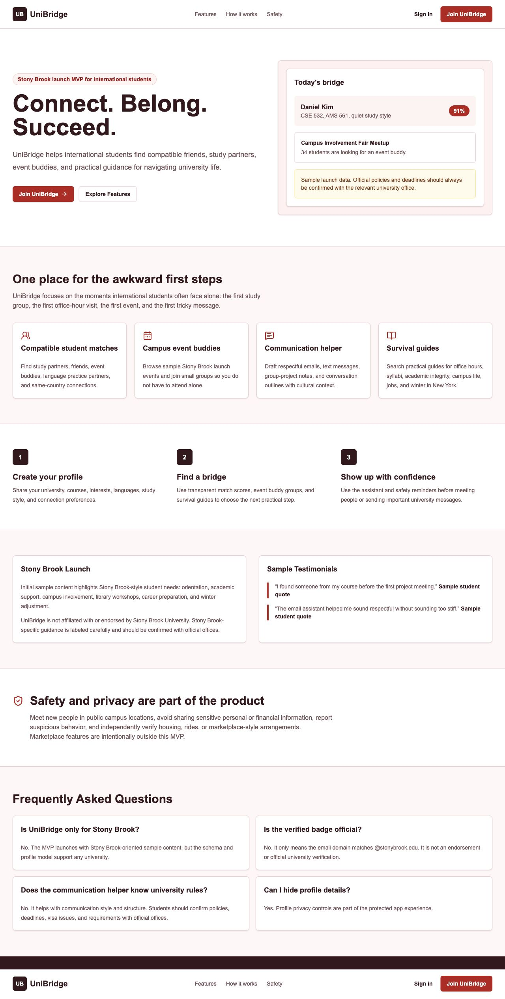
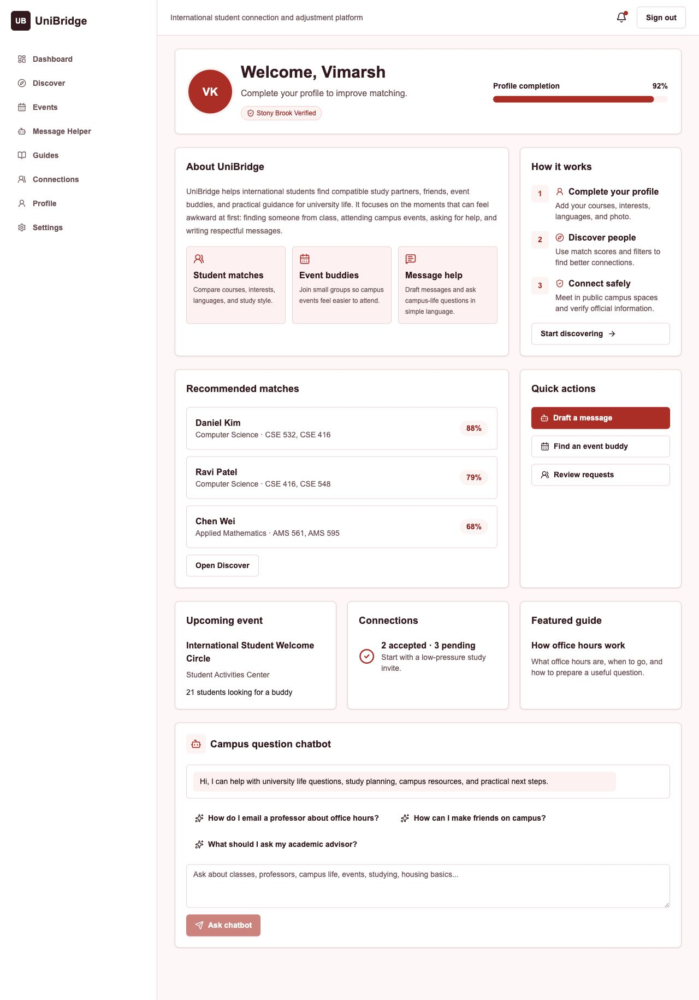
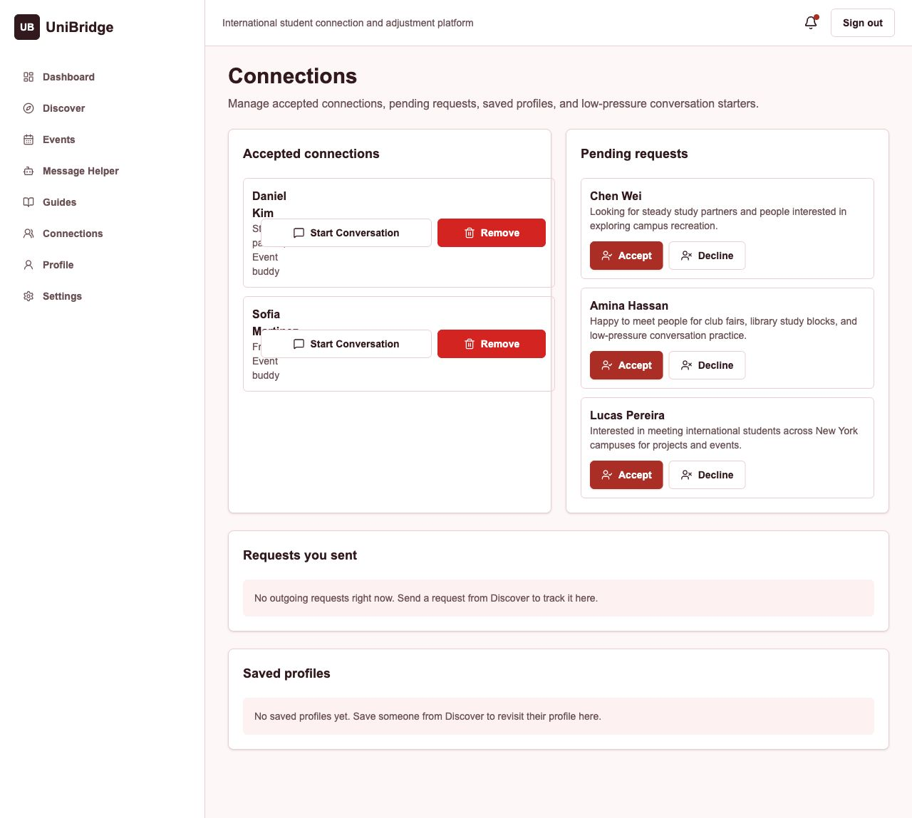

# UniBridge

**Connect. Belong. Succeed.**

UniBridge is a student connection and adjustment platform for international university students. It helps students build a useful profile, discover compatible classmates, send connection requests, find event buddies, create small groups, read practical guides, and draft respectful university messages.

UniBridge is built for deployment with Supabase, Groq, and Vercel, with Stony Brook-oriented sample content for launch testing.

## Screenshots

### Landing Page



### Dashboard




### Connections




## What Users Can Do

- Create an account with a university email
- Complete a profile with university, major, courses, languages, interests, bio, and profile photo
- See profile completion progress
- Discover student matches with visible match scores
- Send, accept, decline, and remove connection requests
- Save profiles and revisit them from the Connections area
- Browse campus events
- Join events and request an event buddy
- Create, join, leave, and delete buddy groups
- Use a campus question chatbot on the dashboard
- Draft more respectful university messages with the communication helper
- Read survival guides for common international student questions

## Tech Stack

- Next.js App Router
- TypeScript
- Tailwind CSS
- Supabase Auth and PostgreSQL
- Groq API through secure server routes
- Zod validation
- Lucide React icons
- Vitest tests
- Vercel deployment

## Project Structure

```bash
app/                 Next.js routes and pages
components/          Reusable UI and feature components
lib/                 Data, stores, validation, matching, and Supabase helpers
supabase/            Reset, schema, and seed SQL files
docs/screenshots/    README screenshots
```

## Environment Variables

Create `.env.local` from `.env.example` and add:

```bash
NEXT_PUBLIC_SUPABASE_URL=
NEXT_PUBLIC_SUPABASE_ANON_KEY=
SUPABASE_SERVICE_ROLE_KEY=
GROQ_API_KEY=
NEXT_PUBLIC_APP_URL=http://localhost:3000
```

Do not commit real keys.

## Local Setup

```bash
npm install
npm run dev
```

Open:

```bash
http://localhost:3000
```

## Supabase Setup

Run these files in Supabase SQL Editor in this order:

1. `supabase/reset.sql`
2. `supabase/schema.sql`
3. `supabase/seed.sql`

Use `reset.sql` only when you are okay deleting old test data.

The schema includes row-level security so user-owned actions stay scoped to the signed-in account.

## Useful Commands

```bash
npm run dev
npm run build
npm run lint
npm run typecheck
npm test
```

## Deployment

Deploy with Vercel:

1. Push this project to GitHub.
2. Import the GitHub repo in Vercel.
3. Add the environment variables in Vercel.
4. Run the Supabase SQL files.
5. Deploy.
6. Add the live Vercel URL in Supabase Authentication URL settings.

Recommended Supabase redirect URLs:

```bash
https://your-vercel-project.vercel.app/**
http://localhost:3000/**
```

## Safety Notes

UniBridge is designed around safer student connections. Students should meet in public campus spaces, avoid sharing sensitive personal or financial information, report suspicious behavior, and confirm official university policies with the correct university office.

Sample Stony Brook content is for launch testing and should not be presented as official university policy.
